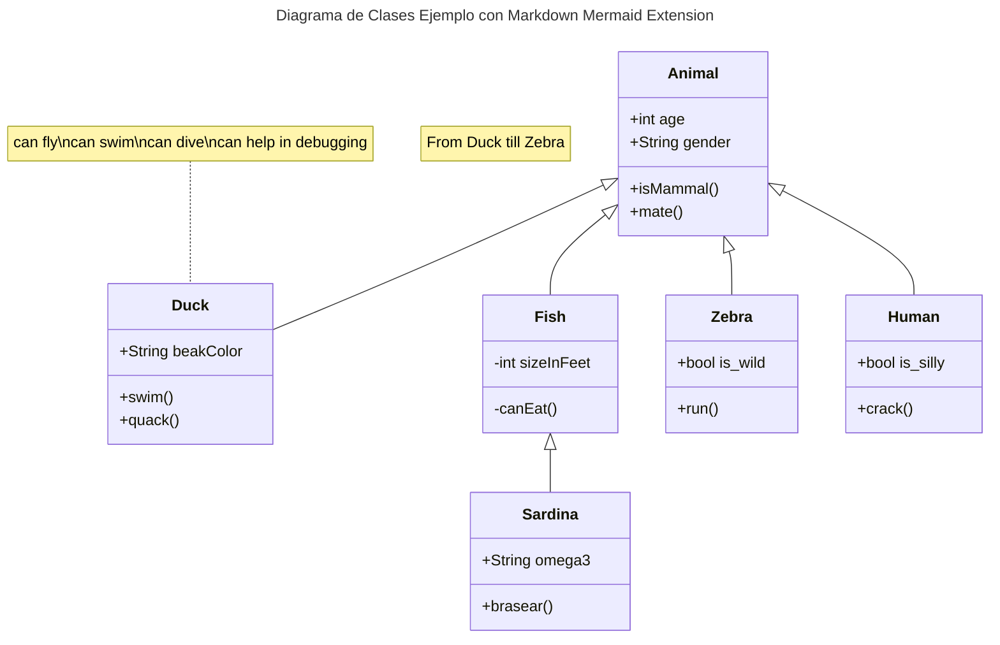

```mermaid
---
title: Diagrama de Clases Ejemplo con Markdown Mermaid Extension
---
classDiagram
    note "From Duck till Zebra"
    Animal <|-- Duck
    note for Duck "can fly\ncan swim\ncan dive\ncan help in debugging"
    Animal <|-- Fish
    Animal <|-- Zebra
    Animal <|-- Human
    Fish <|-- Sardina
    
    Animal : +int age
    Animal : +String gender
    Animal: +isMammal()
    Animal: +mate()
    class Duck{
        +String beakColor
        +swim()
        +quack()
    }
    class Fish{     
        -int sizeInFeet
        -canEat()
    }
    class Zebra{
        +bool is_wild
        +run()
    }
    class Human{
        +bool is_silly
        +crack()
    }
    class Sardina{
        +String omega3
        +brasear()
    }
```