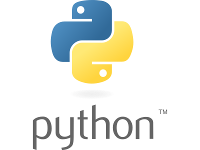

<div></div>

# PythonFS_UD00

Nota: Parece que dentro de MKDocs no funciona, aunque aquí si.
Please see the [project license](../externo.md) for further details

Este proyecto utiliza Reflex para crear una aplicación web básica. A continuación, se describen los pasos y componentes principales del proyecto.

## Ruta de Aprendizaje

- [x] Aprender Python Básico
- [ ] Aprender FastAPI
- [ ] Aprender ORM
- [ ] Aprender Reflex

## Estructura del Proyecto

!!! note annotate "Nota inicial (1)"

    Se está usando MKDocs Material, (2) Y poco a poco saldrá mejor.
    Esto es una nota desplegable

1.  :man_raising_hand: I'm an annotation!
2.  :woman_raising_hand: I'm an annotation as well!

??? info annotate "Nota desplegable (1)"

    Se está usando MKDocs Material, (2) Y poco a poco saldrá mejor.
    Esto es una nota con anotaciones (+) que pueden seguirse


| Method      | Description                          |
| ----------- | ------------------------------------ |
| `GET`       | :material-check:     Fetch resource  |
| `PUT`       | :material-check-all: Update resource |
| `DELETE`    | :material-close:     Delete resource |

## Configuración

El archivo [`rxconfig.py`](rxconfig.py) contiene la configuración básica de la aplicación Reflex:

```python
import reflex as rx

config = rx.Config(
    app_name="PythonFS_UD00",
)
```

## Databases
Reflex uses **sqlmodel** to provide a built-in **ORM** wrapping **SQLAlchemy**.

The examples on this page refer specifically to how Reflex uses various tools to expose an integrated database interface. Only basic use cases will be covered below, but you can refer to the sqlmodel tutorial for more examples and information, **just replace SQLModel with rx.Model and Session(engine) with rx.session()**

*For advanced use cases, please see the SQLAlchemy docs (v1.4).*


### Connecting
Reflex provides a built-in SQLite database for storing and retrieving data.

You can connect to your own SQL compatible database by modifying the rxconfig.py file with your database url.

```python
config = rx.Config(
    app_name="my_app",
    db_url="sqlite:///reflex.db",
)
```
For more examples of database URLs that can be used, see the SQLAlchemy docs. Be sure to install the appropriate DBAPI driver for the database you intend to use.

### Tables
To create a table make a class that inherits from rx.Model with and specify that it is a table.

```python
class User(rx.Model, table=True):
    username: str
    email: str
    password: str
```

### Migrations
Reflex leverages alembic to manage database schema changes.

Before the database feature can be used in a new app you must call ```reflex db init``` to initialize *alembic* and create a migration script with the current schema.

After making changes to the schema, use ```reflex db makemigrations --message 'something changed'``` to generate a script in the *alembic/versions* directory that will update the database schema. It is recommended that scripts be inspected before applying them.

The ```reflex db migrate``` command is used to apply migration scripts to bring the database up to date. During app startup, if Reflex detects that the current database schema is not up to date, a warning will be displayed on the console.

**Nota:**
Todo este sistema de BBDD integrado se encarga de:
1. Crear/usar la BBDD configurada en rxconfig.py
2. Crear/mantener las tablas y definiciones de acuerdo a las clases que heredan de rx.Model.

Para ello, la combinación de los tres comandos anteriores, ofrecen:

1. La inicialización de la BBDD
        ```reflex db init```
2. La creación/actualización de un esquema de BBDD según las clases que heredan de rx.Model
        ```reflex db makemigrations [--message 'something changed']```

        Nota: Para que se cree/modifique la BBDD, las class model han de ser visibles desde el fichero principal del proyecto Reflex.

3. La aplicación de dicho esquema a la BBDD en producción.
        ```reflex db migrate```
